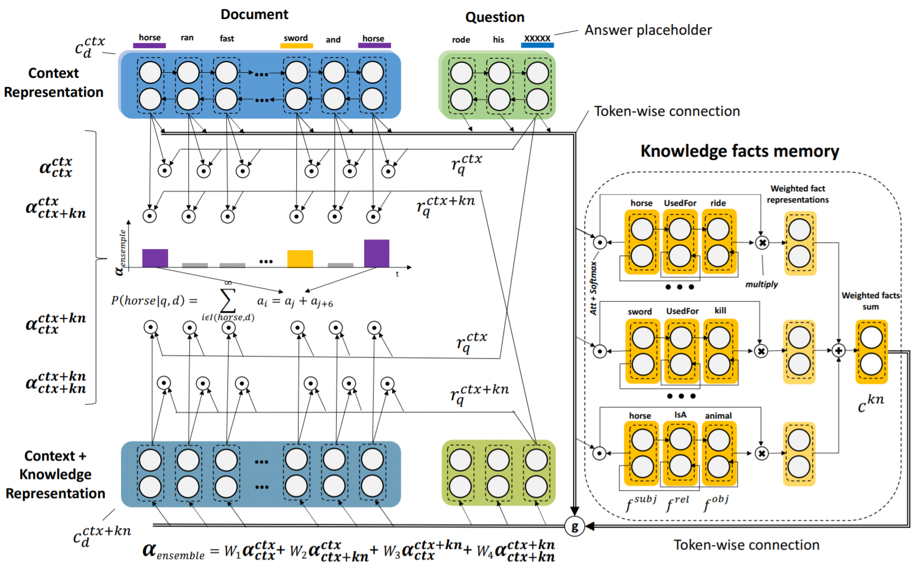
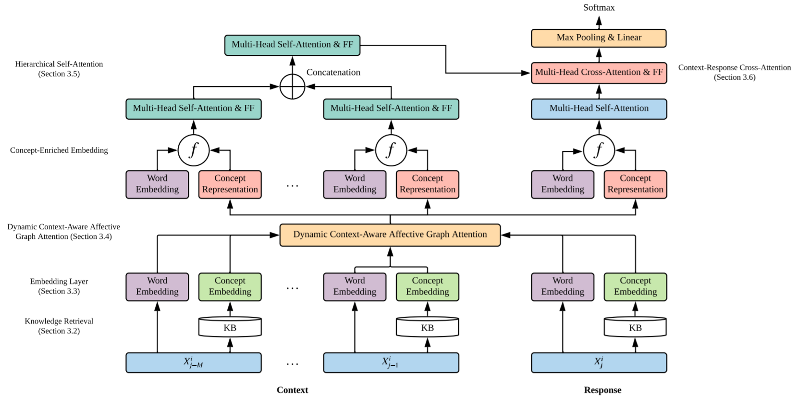
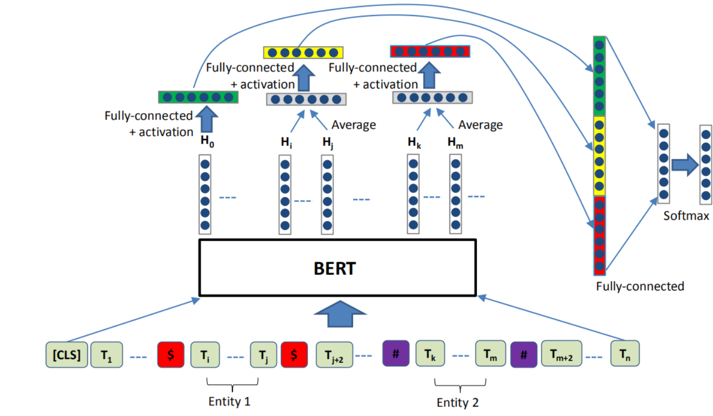
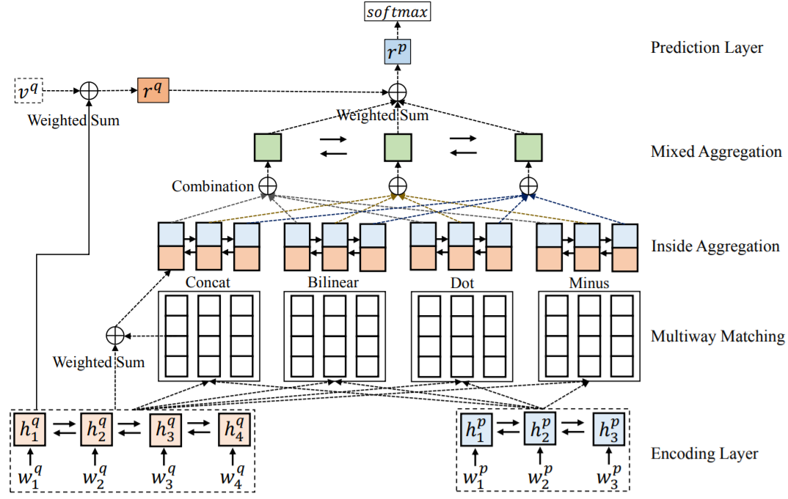

# Papers-reader
Write down the papers I have read.

A list of recent papers about **Knowledge-enhanced language model**(K-papers) and **Domain adaptation**(D-papers).
Update on **July. 12, 2020**.
(We will continuously update this list.)

-------
## [Content](#content)
1. [K-Papers](#k-papers)
2. [D-Papers](#d-papers)
3. [Related papers](#related-papers)
4. [Others](#others)

## [K-Papers](#content)
1. **Knowledgeable Reader: Enhancing Cloze-Style Reading Comprehension with External Commonsense Knowledge**

    Authors: *Todor Mihaylov, Anette Frank*
    
    Department: *Research Training Group AIPHES Department of Computational Linguistics, Heidelberg University Heidelberg, Germany*
 

2. **Knowledge-Enriched Transformer for Emotion Detection in Textual Conversations** *EMNLP 2019* [[paper](https://arxiv.org/abs/1909.10681)]
 

3. **Align, Mask and Select: A Simple Method for Incorporating Commonsense Knowledge into Language Representation Models** *arxiv 2020* [[paper](https://arxiv.org/abs/1908.06725)]

## [D-Papers](#content) 
1. **Instance Weighting for Domain Adaptation via Trading off Sample Selection Bias and Variance** *IJCAI 2018*  [[paper](https://www.ijcai.org/Proceedings/2018/0624.pdf)]

2. **Task Refinement Learning for Improved Accuracy and Stability of Unsupervised Domain Adaptation** *ACL 2019*  [[paper](https://www.aclweb.org/anthology/P19-1591.pdf)]

3. **Unsupervised Domain Adaptation for Clinical Negation Detection** *BioNLP 2017* [[paper](https://www.aclweb.org/anthology/W17-2320.pdf)]

4. **Domain Adaptive Training BERT for Response Selection** *arxiv 2019* [[paper](https://arxiv.org/abs/1908.04812)]

5. **Learning to select data for transfer learning with Bayesian Optimization** *EMNLP 2017* [[paper](https://arxiv.org/abs/1707.05246) / [note](https://ruder.io/learning-select-data/index.html)]

    Authors: *Sebastian Ruder, Barbara Plank* 

6.  **Neural Transfer Learning for Natural Language Processing (PhD thesis)** *PhD 2019* [[paper](https://ruder.io/thesis/neural_transfer_learning_for_nlp.pdf) / [note](https://ruder.io/thesis/index.html)]

7. **How Does NLP Benefit Legal System: A Summary of Legal Artificial Intelligence** *ACL 2020* [[paper](https://arxiv.org/abs/2004.12158)]

8. **Don’t Stop Pretraining: Adapt Language Models to Domains and Tasks** *ACL 2020* [[paper](https://arxiv.org/pdf/2004.10964.pdf)]

9. **Unsupervised Domain Clusters in Pretrained Language Models** *ACL 2020* [[paper](https://arxiv.org/pdf/2004.02105.pdf)]

10. **Pretrained Transformers Improve Out-of-Distribution Robustness** *ACL 2020* [[paper](https://arxiv.org/abs/2004.06100)]

## [Related papers](#content)
1. **Enriching Pre-trained Language Model with Entity Information for Relation Classification** *CIKM2019*. [[paper](https://arxiv.org/abs/1905.08284) / [note](https://blog.csdn.net/qq_36426650/article/details/96629835)]

    Authors: *Shanchan Wu, Yifan He*
    
   **要点**
   
- 为了能够定位两个目标实体，并将其信息转移到BERT中，在将整个问题喂入BERT前，在目标实体前后添加token，亦即符号“$”和“#”;
- 使用每个字符输入的相加平均值表示实体向量.

 

2. **Multiway Attention Networks for Modeling Sentence Pairs** *IJCAI 2018*  [[paper](https://pdfs.semanticscholar.org/2b32/b4fa1e28c256745f1573b5444b1b2c8df30e.pdf)]

   **要点**
    
- 使用多种注意力机制

 

3. **Latent Retrieval for Weakly Supervised Open Domain Question Answering** *ACL 2019*  [[paper](https://arxiv.org/abs/1906.00300)]

   **要点**
    
- 使用[CLS]位置的向量内积来检索文章

## [Others](#content)
1. [BERT相关论文列表](https://www.ctolib.com/tomohideshibata-BERT-related-papers.html)
2. [Must-read papers on KRL/KE](https://github.com/thunlp/KRLPapers)
3. [预训练词向量/句向量模型的精选列表](https://www.ctolib.com/Separius-awesome-sentence-embedding.html)
4. [A Collection of BERT Papers](https://github.com/nslatysheva/BERT_papers)
5. [当BERT遇上知识图谱](https://blog.csdn.net/Kaiyuan_sjtu/article/details/102857555)
6. [Dive into BERT：语言模型与知识](https://blog.csdn.net/Kaiyuan_sjtu/article/details/103073784)
7. [AI赋能法律 | NLP最强之谷歌BERT模型在智能司法领域的实践浅谈](https://zhuanlan.zhihu.com/p/54934304)
8. [Why BERT Fails in Commercial Environments](https://www.intel.com/content/www/us/en/artificial-intelligence/posts/bert-commercial-environments.html#gs.ykp1xd)
9. [从感知到认知：浅谈知识赋能自然语言处理](https://developer.aliyun.com/article/741285?spm=a2c6h.12873581.0.0.345f187aGFSGOQ)
10. [CCKS&百度 2019中文短文本的实体链指 第一名解决方案](https://github.com/panchunguang/ccks_baidu_entity_link)
11. [注意力机制的动力学机理是什么？](https://www.zhihu.com/question/340480781)
12. [transformer和LSTM对比的设想？](https://www.zhihu.com/question/311377593?sort=created)
13. [放弃幻想，全面拥抱Transformer：自然语言处理三大特征抽取器（CNN/RNN/TF）比较](https://zhuanlan.zhihu.com/p/54743941)
14. [记忆网络-Memory Network](https://zhuanlan.zhihu.com/c_129532277)
15. [记忆网络之Gated End-to-End Memory Networks](https://zhuanlan.zhihu.com/p/30722242)
